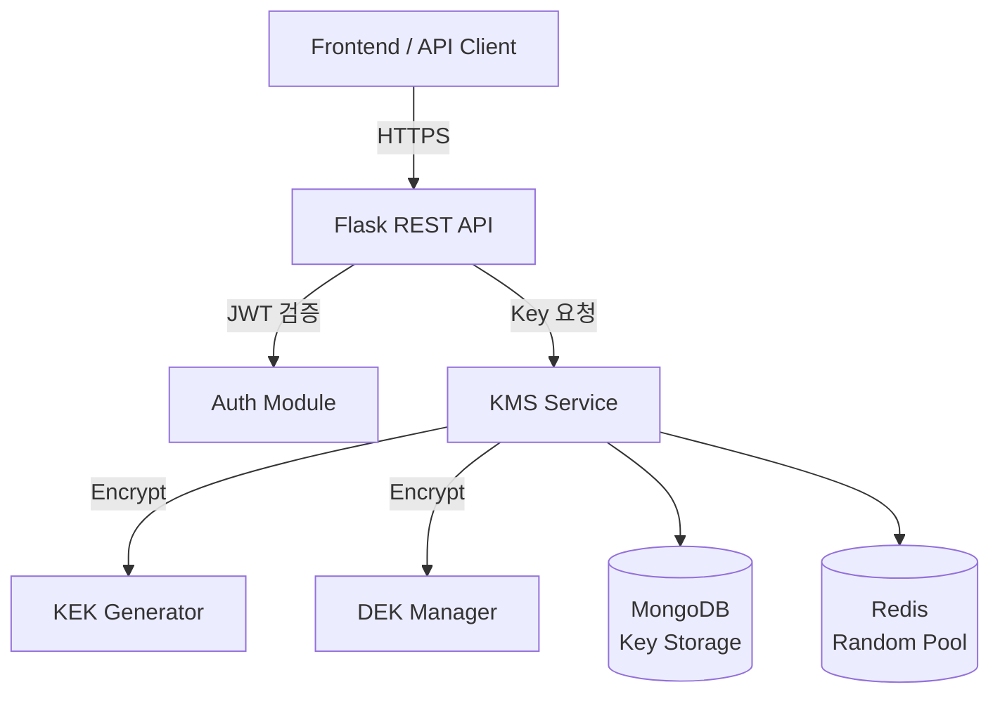

# 🔐 Key Management System Project (KMS)

> **실무 프로젝트 기반**
> 공공기관 제도 및 심사를 통과한 인증·암호화 키 관리 시스템

---

## 📌 프로젝트 개요

암호 키(Key)의 **생성 · 암호화 · 저장 · 재발급 · 만료 관리**를 수행하는
인증 기반 **Key Management System(KMS)** 입니다.

* Flask 기반 REST API
* JWT + CSRF 인증 구조
* MongoDB TTL 인덱스를 활용한 키 자동 만료
* Redis 기반 난수 풀(Random Pool) 사용

실제 서비스 환경을 가정하여 **보안·확장성·운영성**을 고려해 설계되었습니다.

---

## 🧩 담당 역할

* **Backend 및 Frontend 화면 구현**
* 인증/인가 로직 설계 (JWT, CSRF)
* 키 암호화 구조 설계 (KEK / DEK)
* MongoDB · Redis 연동
* API 설계 및 구현
* 서비스 문서화 및 운영 구조 설계

---

## ⚙️ 시스템 아키텍처



---

## 🔐 보안 설계

### 🔑 Key Encryption 구조

* **KEK (Key Encryption Key)**

  * 사용자 ID + Password 기반 생성
* **DEK (Data Encryption Key)**

  * 실제 키 데이터를 암호화하는 키
* 키 저장 시

  * `DEK → KEK로 암호화 → MongoDB 저장`

➡ 사용자 인증 없이는 **키 복호화 불가**

---

## 🧪 주요 기능

### ✔ 키 발급

* 사용자 요청에 따라 다양한 형식의 키 생성
* UUID / 문자열 / 숫자 / Hex 등
* 만료일(expire_date) 설정 가능

### ✔ 키 재발급

* 기존 키 검증 후 새로운 키 재발급

### ✔ 키 삭제

* 명시적 삭제 요청
* 또는 TTL 기반 자동 삭제

### ✔ 토큰 검증

* JWT 기반 사용자 인증
* CSRF 토큰 병행 사용

---

## 📡 REST API 요약

| Endpoint             | Method | Description |
| -------------------- | ------ | ----------- |
| `/issue_key`         | POST   | 키 발급        |
| `/reissuance_key`    | POST   | 키 재발급       |
| `/delete_issued_key` | POST   | 키 삭제        |
| `/key_data_refresh`  | POST   | 키 만료일 갱신    |
| `/decode_token`      | POST   | JWT 유효성 검증  |
| `/get_csrf_token`    | GET    | CSRF 토큰 발급  |

---

## 🗂️ 프로젝트 구조

```
quardian
 ┣ 📂app.py              # Flask 앱 엔트리포인트
 ┣ 📂register.py         # 회원가입 / 로그인
 ┣ 📂kms_service.py      # 키 관리 핵심 로직
 ┣ 📂auth_utils.py       # JWT / CSRF 유틸
 ┣ 📂db                  # MongoDB 설정
 ┣ 📂redis               # Redis 연결
 ┗ 📂requirements.txt
```

---

## 🚀 실행 방법

### 1️⃣ 환경 설정

```bash
pip install -r requirements.txt
```

### 2️⃣ 환경 변수

```bash
export MONGO="mongodb://localhost:27017"
export REDIS_HOST="localhost"
export REDIS_PORT="6379"
```

### 3️⃣ 실행

```bash
python app.py
```

---

## 🏆 성과

* ✔ **신속확인제도 통과**
* ✔ **조달청 심사 통과 후 서비스 등록**
* ✔ 실무 수준의 보안 아키텍처 구현
* ✔ Backend/Frontend 설계 및 구현 경험

---

## 🔮 확장 아이디어

* RBAC(Role Based Access Control)
* HSM / AWS KMS 연동
* API Rate Limit 적용
* 관리자 대시보드

---

## 👨‍💻 Author

**장원종 (JangWonJong)**
Backend Developer
GitHub: [https://github.com/JangWonJong](https://github.com/JangWonJong)

---

> 본 프로젝트는 실무 경험을 바탕으로 설계된 **포트폴리오용 KMS 프로젝트**입니다.
